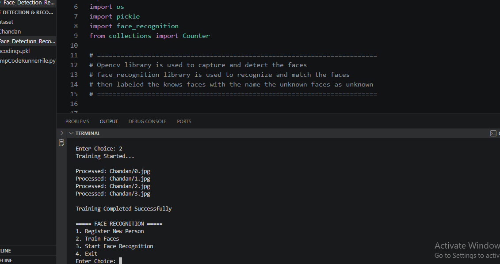

# Face Detection and Recognition System

## Overview

This project is a Face Detection and Face Recognition System developed using Python, OpenCV, and the face_recognition library. The system can detect faces from images, generate facial encodings, and recognize previously registered individuals.

The project demonstrates the practical application of Computer Vision and Artificial Intelligence in biometric identification systems.

---

## Features

* Face Registration using images
* Face Detection using OpenCV
* Face Encoding Generation
* Face Recognition using stored encodings
* Dataset Management
* Recognition of known individuals from input images

---

## Technologies Used

* Python 3
* OpenCV
* face_recognition
* NumPy
* Pickle

---

## Project Structure

```text
Face-Detection-Recognition/
│
├── Face_Detection_Recognition.py
├── encodings.pkl
├── .gitignore
│
├── dataset/
│   └── Chandan/
│       ├── 0.jpg
│       ├── 1.jpg
│       ├── 2.jpg
│       └── 3.jpg
│
└── README.md
```

---

## How It Works

### Step 1: Face Registration

The user provides a person's name and corresponding face images are stored in the dataset folder.

### Step 2: Face Encoding

The system extracts facial features from the registered images and generates numerical face encodings.

These encodings are stored in:

```text
encodings.pkl
```

### Step 3: Face Recognition

When a new image is provided, the system:

1. Detects faces in the image.
2. Extracts face encodings.
3. Compares them with stored encodings.
4. Identifies the matching person.

---

## Installation

### Clone the Repository

```bash
git clone https://github.com/Chandan-bt6/Face-Detection-Recognition.git
cd Face-Detection-Recognition
```

### Install Required Libraries

```bash
pip install opencv-python
pip install face-recognition
pip install numpy
```

Or:

```bash
pip install -r requirements.txt
```

---

## Usage

Run the project:

```bash
python Face_Detection_Recognition.py
```

Follow the on-screen instructions to register faces and perform recognition.

---

## Screenshots

### Face Registration

.png)
.png)

### Training



### Face Recognition

.png)
.png)

### Unknown Face

.png)
.png)

## Applications

* Smart Attendance Systems
* Access Control Systems
* Identity Verification
* Security and Surveillance
* AI-Based Recognition Systems

---

## Future Improvements

* Real-time webcam face recognition
* Multiple face recognition support
* GUI-based application
* Attendance management integration
* Database connectivity
* Deep Learning-based face recognition models

---

## Author

**Chandan Bisht**

B.Tech Student
Python Developer
Computer Vision & AI Enthusiast

GitHub: https://github.com/Chandan-bt6

---

## License

This project is developed for educational and learning purposes.
